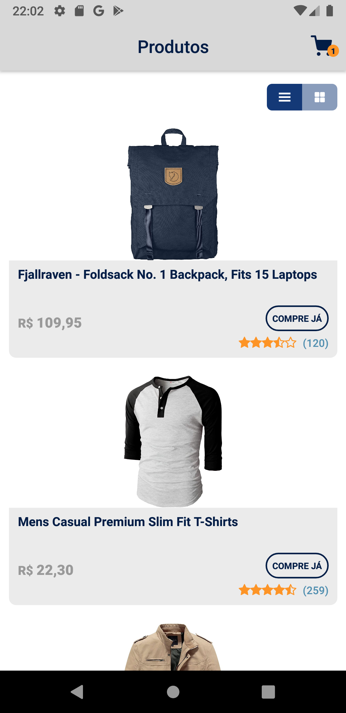
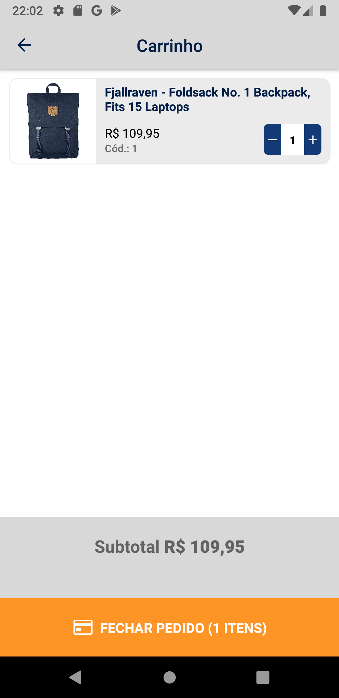

# VittaTonApp

- [VittaTonApp](#vittatonapp)
  - [SOLUÇÃO](#solução)
  - [FUNCIONAMENTO](#funcionamento)
  - [INSTALAÇÃO](#instalação)
  - [COMO RODAR](#como-rodar)
  - [SCREENSHOTS](#screenshots)

## SOLUÇÃO

Projeto criado com o comando `npx react-native init VittaTonApp  --template react-native-template-typescript` utilizando a versão `0.66.4`. Segue as definições do teste (enviado via e-mail).

Roda em dispositivos Android.

**O apk pode ser baixado [aqui](https://github.com/filipepiresg/vitta-ton-app/releases)**

## FUNCIONAMENTO

Ao abrir o app, ele irá carregar os produtos do gist e irá popular a lista de produtos. Além disso, nele é possível mudar o tipo de visualização de lista para grade, e vice-versa. Com a lista carregada, é possível adicionar ao carrinho atravês do botão "COMPRE JÁ", que irá adicionar 1 unidade do produto ao carrinho para cada vez pressionado. Em seguida, surgirá um indicativo (no canto superior direito) de quantas unidades de produtos foram adicionadas ao carrinho.

Ao abrir o carrinho, será possível visualizar os produtos inseridos no carrinho, de aumentar e/ou diminuir a quantidade de unidades de um produto, visualizar o total das compras e além de "pagar pelos produtos".

Ao fechar o aplicativo com um carrinho preenchido, ele é salvo no storage do device e na próxima abertura do app ele irá mostrar novamente.

> Foi utilizado ContextAPI pelo fato do projeto ser pequeno, e de não ter visto a necessidade de utilizar `redux` e não era um requerimento do desafio.

## INSTALAÇÃO

Requisitos:

- [NodeJS](https://nodejs.org/en/download/)
- [React-native](https://facebook.github.io/react-native/docs/getting-started)
- **Android Studio**[1]

Primeiro, baixar e instalar o NodeJS na versão LTS.

Instalação para dispositivos Android

Após a conclusão do comando anterior, é necessário baixar e instalar o Android Studio e também criar um emulador\*.

\* Para mais informações, abrir a documentação do react-native abaixo.

[Documentação do React-Native](https://facebook.github.io/react-native/)

> [1] Para máquinas Mac/Windows/Linux

## COMO RODAR

Após obter o repositório do projeto, por clone (com o comando `git clone https://github.com/filipepiresg/vitta-ton-app`) ou download, deverá ser feito o download das dependências do projeto através do comando `yarn install` no terminal.

Se tudo estiver dado certo, o projeto já deve estar funcionando perfeitamente e para rodar tem que utilizar o comando `npx react-native run-ios` ou `npx react-native run-android` para dispositivos iOS e android, respectivamente.

 
Caso seja utilizado o android, é necessário abrir o emulador antes de rodar o projeto

Após ter instalado no dispositivo, pela primeira vez, não é necessário rodar esse comando (pois demora demais) podemos simplesmente rodar o comando `npx react-native start` para que o bundler inicie rapidamente.

## SCREENSHOTS

---
